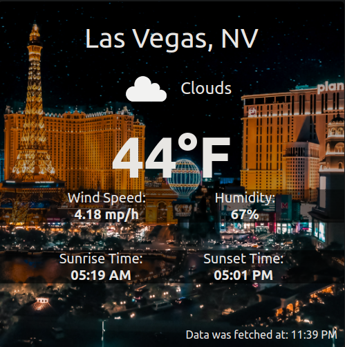

# vegasweather-react-app

This is a react application made to display the weather of Las Vegas, Nevada. It was designed to be placed into a website as a widget/component... and interfaces with the OpenWeatherMap API to retrieve most of its data.

Deployed Website: https://jscjml2.github.io/vegasweather-react-app/

Deploy using "npm run deploy".